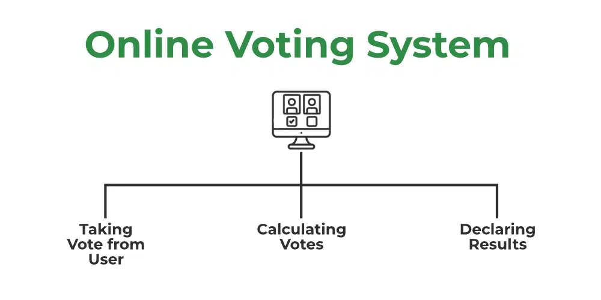

# Election Voting System

This is a simple console-based Election Voting System written in C. Users can cast their votes for one of the candidates or choose "None of These." The system then displays the vote counts and identifies the leading candidate.

## Table of Contents

- [Introduction](#introduction)
- [Features](#features)
- [Getting Started](#getting-started)
- [How to Use](#how-to-use)
- [Contributing](#contributing)

## Introduction



Welcome to the Election Voting System, a simple console-based program written in C that facilitates the voting process for elections. This system allows users to cast their votes for candidates or choose "None of These." The program then calculates and displays the vote counts for each candidate and identifies the leading candidate.

### Overview

The Election Voting System was developed to provide a straightforward and interactive platform for conducting elections in a controlled environment. It is designed for simplicity and ease of use, making it suitable for small-scale elections or educational purposes.

## Features

- **Vote Casting:** Users can choose their preferred candidate or select "None of These."
- **Vote Counting:** The system keeps track of the votes cast for each candidate and spoiled votes.
- **Leading Candidate:** Quickly identify the candidate with the highest number of votes.

## Getting Started

To get started with the Election Voting System, follow the instructions in the [How to Use](#how-to-use) section below.

## How to Use

Follow these steps to use the Election Voting System:

### Prerequisites

- C Compiler (e.g., GCC)

### Installation

1. **Clone the Repository:**
   ```bash
   git clone https://github.com/LohithMarneni/election-management-system.git
2. **Compile and Run the Code:**

    Use a C compiler to compile and to run the election_management_project.c file.
3. **Make Your Choice:**

    Choose a candidate by entering the corresponding number (1-4).
    
    Enter '5' for "None of These."
4. **View Results:**

    To find the total votes for each candidate, choose option 2.
    To identify the leading candidate, choose option 3.

## Why Use This System?

- **Educational Purpose:** This system is an excellent resource for learning the basics of C programming and understanding the logic behind a simple election voting process.
- **Demonstration:** Use it as a demonstration tool in classrooms or workshops to illustrate the fundamentals of election systems.
- **Customization:** Easily modify the code to suit specific requirements or add additional features.

# Contributing

This project was developed by a team of dedicated individuals under the guidance of Tapas Kumar Mishra, Assistant Professor at SRM University AP. The team members are:

- **Team Lead:** Lohith Marneni
- **Team Members:**
  - Lokesh Chirumamilla
  - Sahithi Mukkamala
  - Sukesh Pamujula

## How to Contribute

If you'd like to contribute to this project, We welcome your suggestions, bug reports, and pull requests.

ps: Project Report(in pdf) is available in root folder as election_management_project_report.pdf
